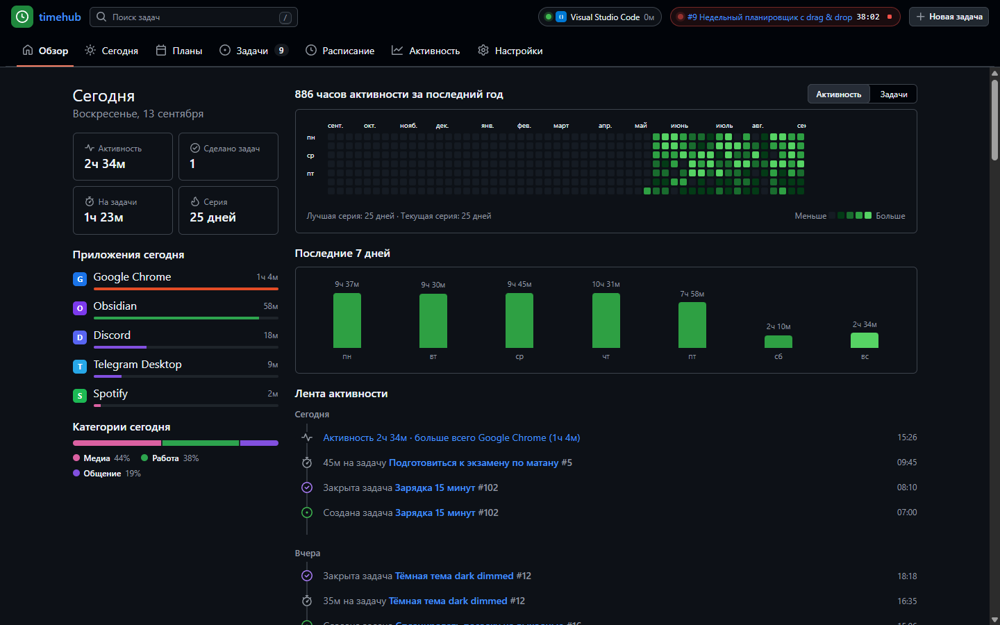
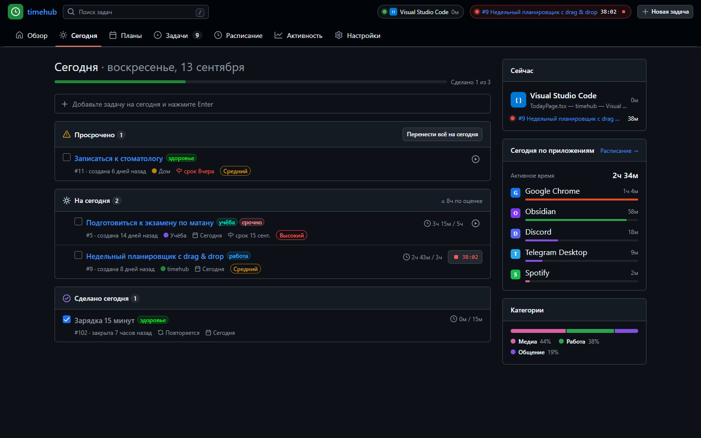
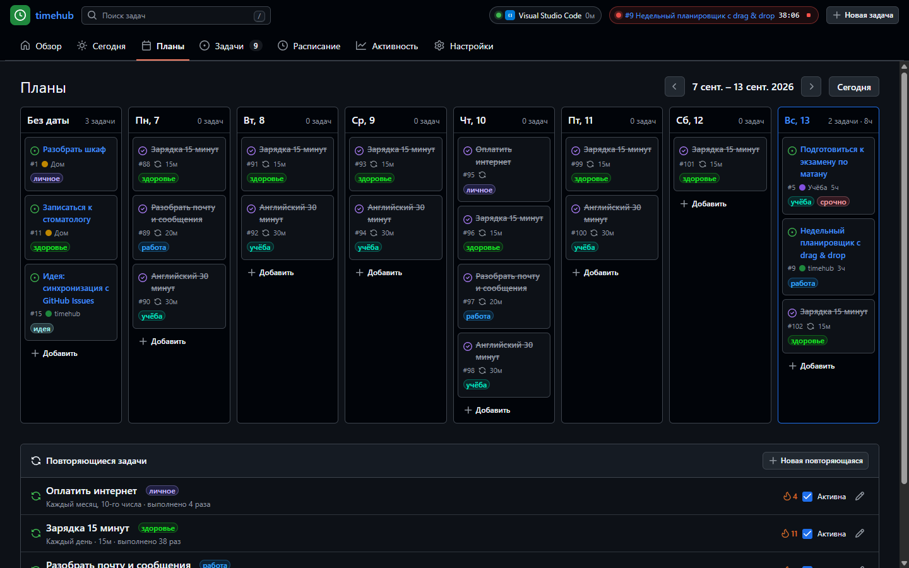
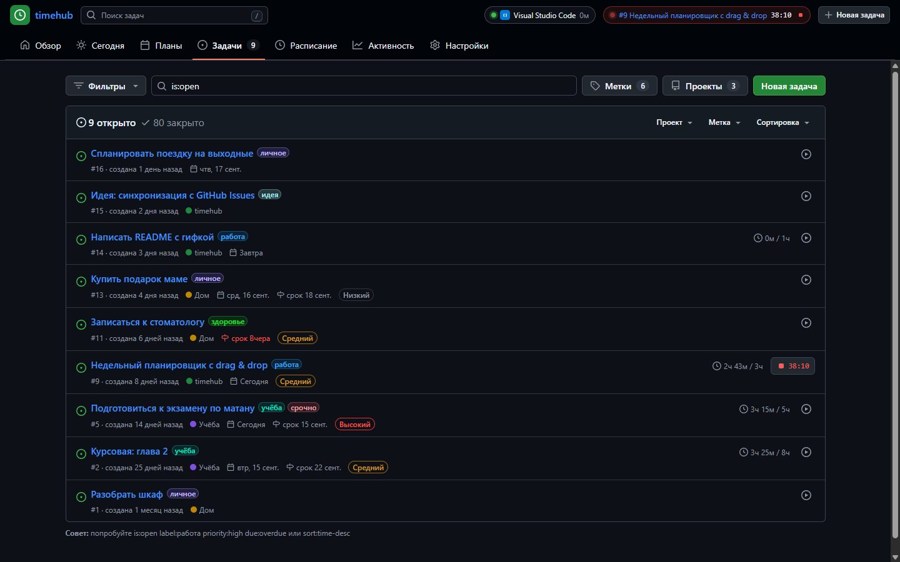
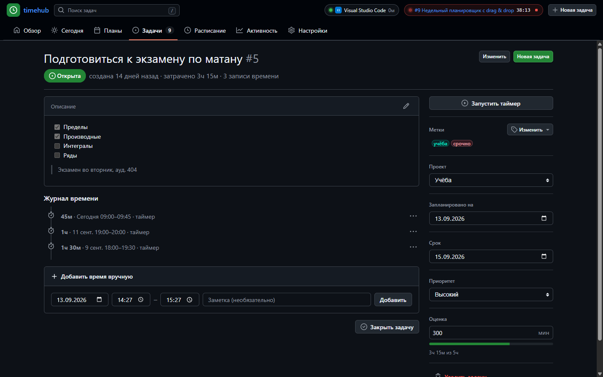
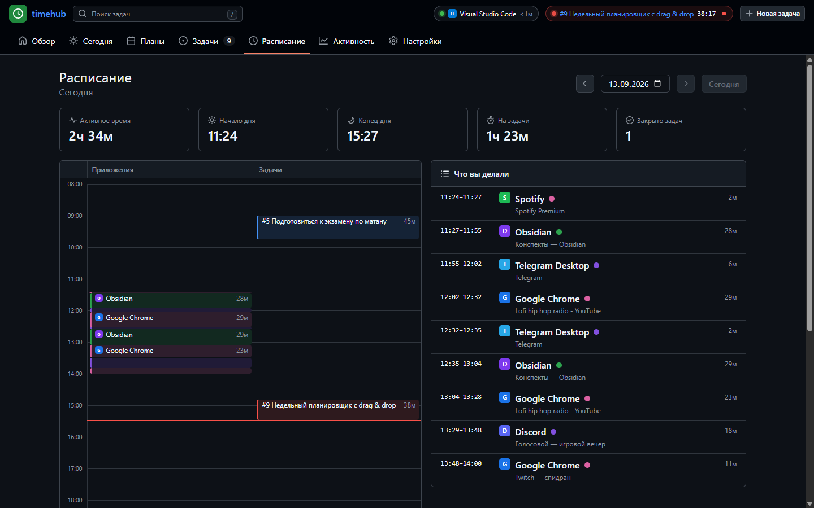
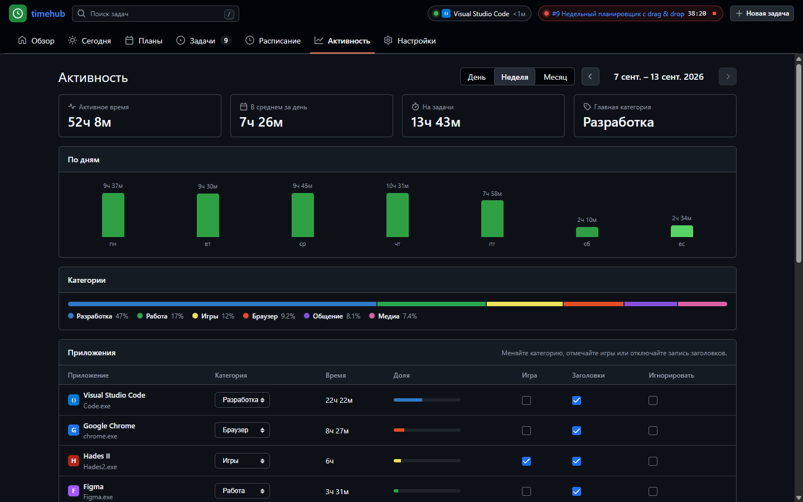
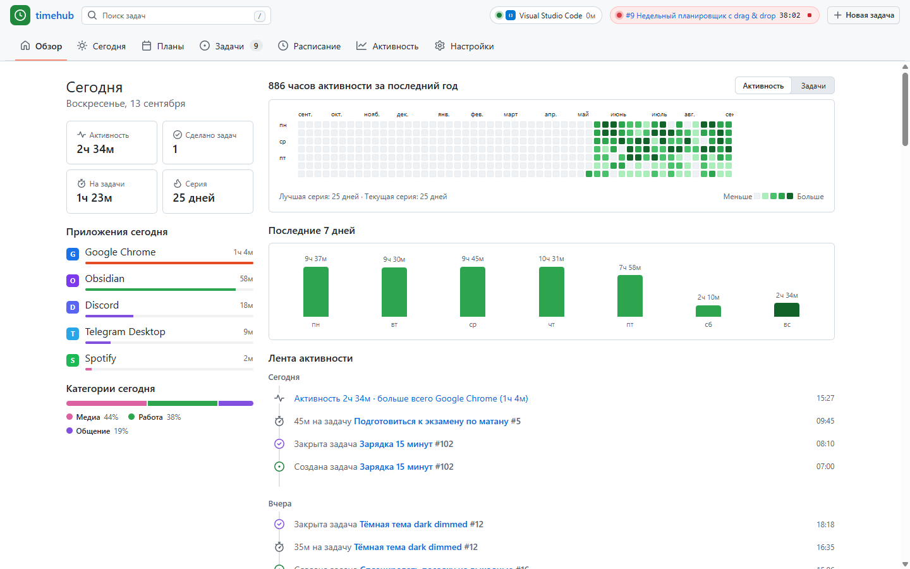
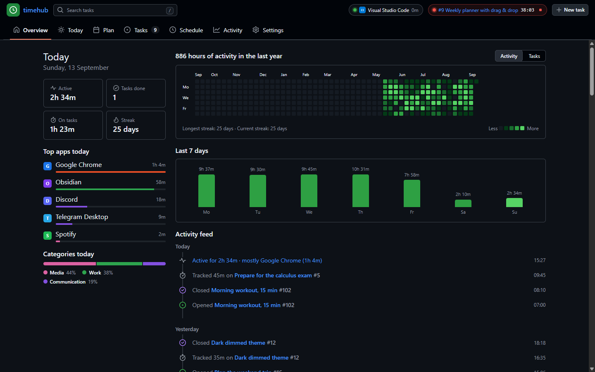

# timehub

**Задачи, учёт времени и автоматическое расписание дня — в стиле GitHub.**
Приложение для Windows, которое само видит, чем вы заняты (как Discord видит игры), и складывает из этого расписание каждого дня.



## Возможности

- **Задачи как GitHub Issues** — номера `#12`, метки, проекты, приоритеты, сроки, Markdown-описания с чек-листами и поиск с квалификаторами: `is:open label:работа due:overdue sort:time-desc`.
- **Учёт времени** — таймер в один клик (в шапке, в трее, в списке задач), ручные записи, оценка и прогресс по ней.
- **Автотрекинг как в Discord** — раз в несколько секунд смотрит активное окно (приложение + заголовок), замечает простой, блокировку и сон, находит запущенные игры (Steam, Epic, Riot, GOG, Battle.net…).
- **Расписание дня** — почасовая шкала «что я делал» и понятный список: `10:05–11:40 · VS Code · 1ч 28м`.
- **Планирование** — страница «Сегодня» с drag & drop, недельная доска и повторяющиеся задачи (каждый день, по будням, по дням недели, раз в месяц) с сериями 🔥.
- **Contribution graph** — зелёные квадратики за год по активному времени или по закрытым задачам, плюс лента событий.
- **Правила** — «Chrome + YouTube → Медиа», «VS Code + timehub → задача #4» или → цель (время засчитывается, только если не идёт таймер, чтобы не считать дважды).
- **Как в Discord** — в шапке «Играет в …» и «Слушает …»; наведите курсор — карточка с обложкой, временем в игре, 🔥 серией и онлайном (Steam, Roblox).
- **Повторы в пару кликов** — «Изучение английского по вторникам и пятницам в 19:00 на 2 часа» прямо из окна новой задачи; можно засчитывать выполнение по набранному времени. Серии 🔥 у задач, целей и игр.
- **Цели** — журнал больших целей: кнопка «Работать над целью» запускает таймер, прогресс вручную или по задачам, подзадачи, записи в журнале.
- **Отчёты по каждому приложению за всё время** — дни, месяцы, часы, дни недели, серии, проекты в редакторах кода.
- **Библиотека** — аниме, манга, книги, фильмы, сериалы и игры со статусами «смотрю / прочитано / пройдено…». Списки AniLib / MangaLib / Shikimori подтягиваются сами, статусы игр обновляются по времени в игре.
- **Подключения** — Steam, Roblox, Epic, музыка Windows, Spotify, статус в Discord, AniLib, Shikimori, TMDB, GitHub (вклады на contribution graph), календари по iCal. Ключи шифруются и не покидают компьютер.
- **Приватность** — всё хранится локально в SQLite. Для каждого приложения можно отключить запись заголовков или игнорировать его совсем; есть пауза и экспорт в JSON/CSV.
- Русский и английский интерфейс, светлая / тёмная / приглушённая тема на [Primer](https://primer.style) — дизайн-системе GitHub.

## Скриншоты

| | |
|---|---|
|  |  |
| **Сегодня** — план на день, просроченное, сделанное, что открыто прямо сейчас | **Планы** — неделя на доске, повторяющиеся задачи и серии |
|  |  |
| **Задачи** — список как Issues с фильтрами | **Задача** — описание, журнал времени, таймер |
|  |  |
| **Расписание** — что вы делали в течение дня | **Активность** — приложения, категории, правила |

<details>
<summary>Светлая тема и английский интерфейс</summary>




</details>

## Установка

Готовый установщик появится в [Releases](https://github.com/mistereshka/timehub/releases). А пока — сборка из исходников (нужен [Node.js 24](https://nodejs.org)):

```bash
git clone https://github.com/mistereshka/timehub
cd timehub
npm install
npm run dev
```

Установщик Windows (NSIS) собирается командой `npm run build:win` и появляется в папке `release/`.

### Демо в браузере

`npm run dev:web` открывает то же приложение на http://localhost:5180 с четырьмя месяцами сгенерированных данных. База работает прямо в браузере (SQLite, скомпилированный в WebAssembly), настоящего трекинга окон там нет. Параметры `?lang=en` и `?theme=light` задают язык и тему.

## Как это устроено

| Слой | Технологии |
|---|---|
| Оболочка | Electron 44, electron-vite |
| Интерфейс | React 19, TypeScript, `@primer/react`, `@primer/primitives`, Octicons |
| Данные | встроенный `node:sqlite`, нативная сборка не нужна; в демо — `sql.js` |
| Win32 | [koffi](https://koffi.dev): `GetForegroundWindow`, `QueryFullProcessImageNameW`, `EnumChildWindows` (для UWP-приложений), `K32EnumProcesses` (для игр), `version.dll` (понятные названия программ) |

Вся логика живёт в [`src/shared/service.ts`](src/shared/service.ts) и одинаково работает в трёх местах: в Electron, в браузерном демо и в тестах.

```
src/
  shared/    сервис, схема БД, повторы, поиск, heatmap, расписание (+ тесты)
  main/      Electron: окно, трей, IPC, трекер активности (Win32 через koffi)
  preload/   мост window.api
  renderer/  React-интерфейс и демо-режим
```

Как работает трекер:
1. Раз в N секунд (по умолчанию 5) он берёт активное окно.
2. Одинаковые подряд «приложение + заголовок» склеиваются в одну сессию.
3. Если ввода с мыши и клавиатуры нет дольше порога, сессия обрезается на моменте последнего ввода.
4. Блокировка экрана и сон закрывают сессию.

Раз в минуту трекер просматривает запущенные процессы и показывает в шапке «Играет в …», если нашёл игру.

## Скрипты

| Команда | Что делает |
|---|---|
| `npm run dev` | Electron в режиме разработки |
| `npm run dev:web` | демо в браузере |
| `npm test` | тесты (vitest) |
| `npm run typecheck` | проверка типов |
| `npm run build:win` | установщик для Windows |

## English

timehub is a GitHub-styled desktop app for Windows:
- tasks (Issues-like, with labels, projects and `is:open label:x` search) and time tracking;
- automatic activity tracking of the foreground window, like Discord's game detection;
- a daily schedule of what you actually did;
- recurring tasks ("English every Tue and Fri at 19:00 for 2 hours") and a weekly planner, with 🔥 streaks;
- a contribution graph of your activity (optionally your GitHub contributions);
- Discord-style "Playing …" / "Listening to …" hover cards, all-time reports per app;
- a goals journal with a goal timer, manual progress and subtasks;
- a library of anime, manga, books, movies, series and games synced from AniLib, Shikimori and Steam;
- connections: Steam, Roblox, Epic, Windows media, Spotify, Discord Rich Presence, TMDB, GitHub, iCal calendars.

All data stays on your machine in SQLite. The UI is available in Russian and English (switch in Settings).
Run `npm install && npm run dev`, or try `npm run dev:web` for an in-browser demo with sample data.

## Лицензия

[MIT](LICENSE)
