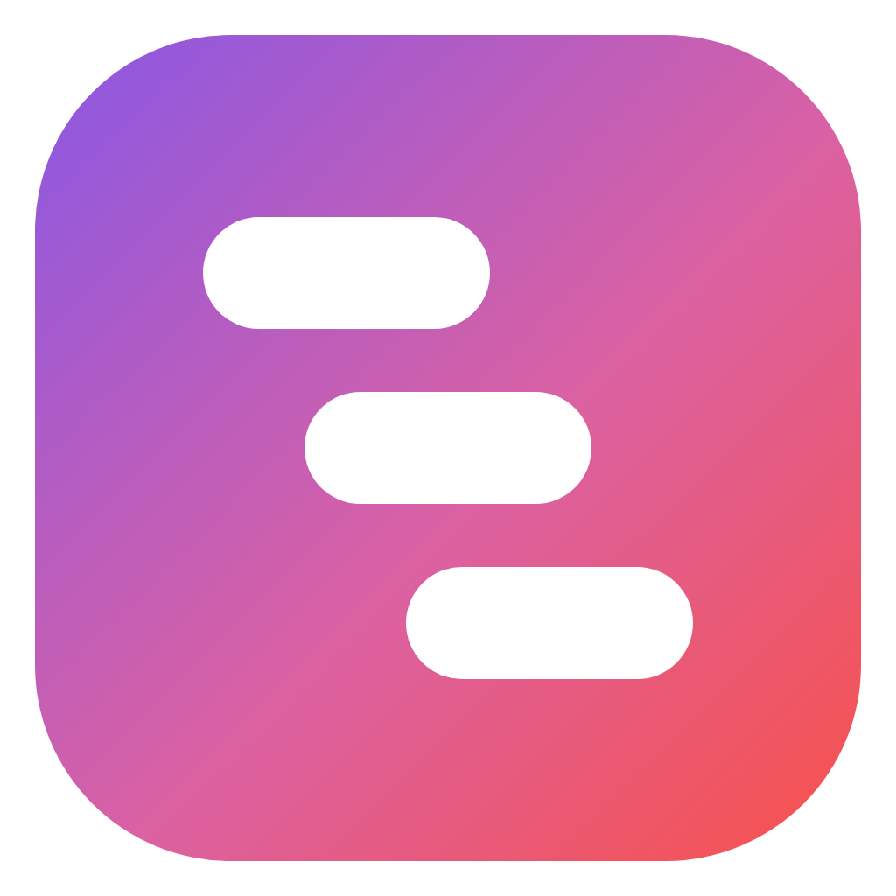

# timehub

**Tasks, time tracking and an automatic timeline of your day — for Windows.**

timehub notices what you're doing on your PC, the way Discord notices games, and turns it into a schedule of every day — right next to your tasks, goals, music, games and chats.


## Features

- **Tasks** — numbered (`#12`), with labels, projects, priorities, due dates, subtasks, progress, Markdown descriptions with checklists and search qualifiers: `is:open label:work due:overdue sort:time-desc`.
- **Time tracking** — a one-click timer in the header, the tray and on every task; manual entries, estimates and progress.
- **Automatic tracking** — samples the foreground window every few seconds and notices idle time, the lock screen and sleep. Browser tabs on known sites (YouTube, Google, Yandex Music, GitHub, anime sites…) count as those sites rather than as "Chrome". timehub never tracks itself.
- **Daily schedule** — an hour-by-hour timeline plus a readable agenda: `10:05–11:40 · VS Code · 1h 28m`. Quick app switches are grouped so the timeline stays readable.
- **Planning** — Today with drag & drop, a weekly board and recurring tasks ("English every Tue and Fri at 19:00 for 2 hours") that can complete by tracked time, with 🔥 streaks.
- **Goals** — a journal of big goals with a goal timer, progress, subtasks and a practice schedule that shows up in Today and on the Schedule.
- **Reminders** — Windows notifications before timed tasks and calendar events.
- **Playing / Listening cards** — hover the header to see the game or track with its cover, time played, streaks, players online (Steam, Roblox) and track controls. Visuals move with the music; you can turn them off.
- **Music** — a player for your own files (MP3/FLAC tags, covers, queue, media keys) and a remote for Yandex Music, Spotify or YouTube. Every play goes to your stats and the library.
- **Games** — everything installed from Steam (several accounts), Epic and Battle.net, plus games the tracker has seen; one click to play. Dota 2 rank, record, recent matches and heroes via OpenDota.
- **Social** — time in Telegram, Discord and other messengers, who you talk to and your calls, taken from Windows' own record of which app used the microphone.
- **Library** — anime, manga, books, films, series, games and music with statuses; AniLib, MangaLib, Shikimori, Steam and NewDeaf keep it up to date.
- **Reports** — an all-time report for every app and site, a contribution graph of your activity and an activity feed.
- **Connections** — Steam, Roblox, Epic, Battle.net, Windows media, Spotify, Discord status, AniLib, Shikimori, NewDeaf, TMDB, GitHub contributions and iCal calendars. Keys are encrypted and never leave your PC.
- **Privacy** — everything is stored locally in SQLite. Turn off window titles for any app or ignore it completely, pause tracking at any time, export to JSON or CSV.
- Russian and English interface; light, dark and dark dimmed themes built on [Primer](https://primer.style).

## Screenshots

| | |
|---|---|
|  |  |
| **Today** — the day's plan, overdue and done tasks, what's open right now | **Plan** — the week on a board, recurring tasks and streaks |
|  |  |
| **Tasks** — a filterable list | **Task** — description, time log, timer |
|  |  |
| **Schedule** — what you did during the day | **Activity** — apps, categories and rules |

<details>
<summary>Light theme and English interface</summary>


</details>

## Install

Download `timehub-Setup-*.exe` from [Releases](https://github.com/mistereshka/timehub/releases) — currently the **v0.2.0** pre-release for Windows 10/11. The installer isn't code-signed yet, so Windows SmartScreen may warn you: choose *More info* → *Run anyway*.

Or build it from source (requires [Node.js 24](https://nodejs.org)):

```bash
git clone https://github.com/mistereshka/timehub
cd timehub
npm install
npm run dev
```

`npm run build:win` builds the Windows installer (NSIS) into `release/`.

### Browser demo

`npm run dev:web` opens the same app at http://localhost:5180 with four months of generated data. The database runs right in the browser (SQLite compiled to WebAssembly); there is no real window tracking there. `?lang=en` and `?theme=light` pick the language and theme.

## How it works

| Layer | Stack |
|---|---|
| Shell | Electron 44, electron-vite |
| UI | React 19, TypeScript, `@primer/react`, `@primer/primitives`, Octicons |
| Data | built-in `node:sqlite` (no native build step); `sql.js` in the demo |
| Win32 | [koffi](https://koffi.dev): `GetForegroundWindow`, `QueryFullProcessImageNameW`, `EnumChildWindows` (UWP apps), `K32EnumProcesses` (games), `version.dll` (friendly app names) |

All the logic lives in [`src/shared/service.ts`](src/shared/service.ts) and runs the same way in Electron, in the browser demo and in the tests.

```
src/
  shared/    service, database schema, recurrence, search, heatmap, schedule (+ tests)
  main/      Electron: window, tray, IPC, activity tracker (Win32 via koffi), integrations
  preload/   the window.api bridge
  renderer/  React UI and the demo mode
```

The tracker:
1. Every N seconds (5 by default) it reads the foreground window.
2. Consecutive samples of the same app and title merge into one session.
3. When there's no keyboard or mouse input for longer than the idle threshold, the session ends at the last input.
4. Locking the screen or going to sleep closes the session.

Once a minute it scans running processes and shows "Playing …" in the header when it finds a game.

## Scripts

| Command | What it does |
|---|---|
| `npm run dev` | Electron in development mode |
| `npm run dev:web` | the browser demo |
| `npm test` | tests (vitest) |
| `npm run typecheck` | type checking |
| `npm run build:win` | the Windows installer |
| `npm run icons` | renders the PNG icons from `resources/*.svg` |

## License

[MIT](LICENSE)
